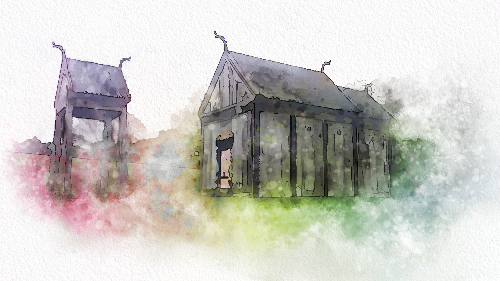
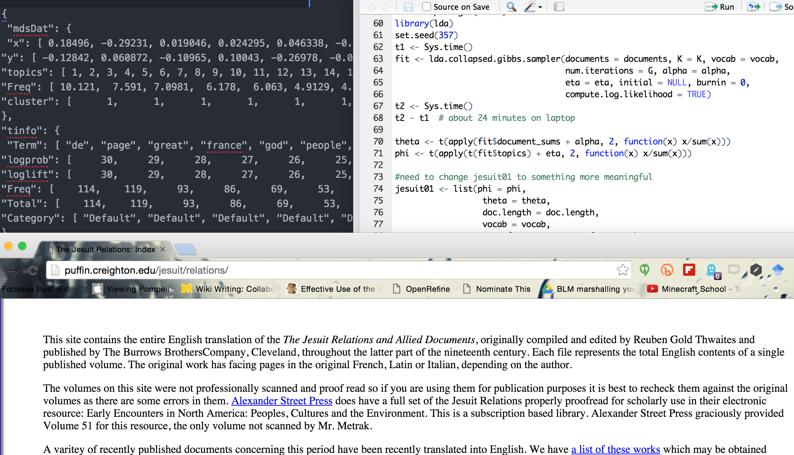

** Cottage **
 

`>`you are standing in a small cottage. There is a **fishing pole** here.
 

Exits are: OUT

---

Yes Keanu. Woah indeed.

---

# Bash

---

_or_

---

## Why I Stopped Assigning Essays and Started Making and Breaking Things

<small>Follow along at [j.mp/sg-bash](http://j.mp/sg-bash)</small>
 
 <small>Dr. Shawn Graham, Dept of History, Carleton [@electricarchaeo](http://twitter.com/electricarchaeo)</small>

---

---

<section data-background="https://farm6.staticflickr.com/5100/5522568035_f8f18fd98b_b_d.jpg">
</section>

---

<section data-background="http://i.imgur.com/pWtl5y8.jpg">
</section>

---

---

I'd prefer if someone called 'bullshit'.

---

<section data-background="https://farm8.staticflickr.com/7085/7318389106_0ffd2210a9_o_d.jpg">
</section>

---

...instrumentalization of learning is part of it.

---

...surveillance masking as 'Engagement Analytics'

---

This isn't a new thing, of course.

---

via [Audrey Watters, whom you must read](http://hackeducation.com/2014/06/22/ed-tech-patents)

---

1866

---

---

[Click Here to Save Education](http://hackeducation.com/2013/03/26/ed-tech-solutionism-morozov)

---

---

But when I hear 'Digital Natives'

---

---

Or when I hear 'gamify!'

---

---

<section data-background="https://farm8.staticflickr.com/7243/13494766293_7ae4e50fef_k_d.jpg">
</section>

---

The Argument So Far:

---

+ Concerns for form over content kill love

---

+ Atomization & measurement kill joy

---

+ Both lead to surveillance and the casual acceptance of the same

---

+ Resulting in what we see in our classrooms.

---

...and the 'essay' is the prime vector.

---

---

---

After a statement like that, I'd better have something good, right?

---

---

No more essays.
 
Let us `essayer` something else.

---

<section data-background="https://farm8.staticflickr.com/7188/6786558606_24bf54c04c_o_d.jpg">
</section>

---

Metaphors Matter.

----
<section data-background="https://farm6.staticflickr.com/5492/9920067926_9a9ba5fb45_o_d.jpg"></section>

---

<section data-background="https://farm8.staticflickr.com/7472/15637796200_3f50cfc72e_o_d.jpg">
The Trousers of Time -T. Pratchett
</section>
Note:
trousers of time lampoons complexity and all the rest of it

---

Weirdness of 'seeing the past'

---

<section data-background="http://www.dayofarchaeology.com/wp-content/uploads/2014/07/IMG_20140711_164910.jpg">
...picture this...
</section>

Note:
We've always been augmenting reality. But maybe we could make things a bit more... awesome. image: http://www.dayofarchaeology.com/cakes-cottages-and-manky-bones/

---

Acknowledge the weird.

Note:
this is where I talk about unessays, about bashing stuff together to see what happens. If we recognize that 'visualizing' and 'essays' are just metaphors, then that makes us see they have a grammar, a form; and if we break away from that we have to establish a new form, a new grammar, and in this, we see things new.

---

"How do we write good history?"
 
...we bash it into a different form.

---

<section data-background="https://farm5.staticflickr.com/4137/4791322423_7213b78fb9_b_d.jpg"></section>

---

---

Some focus on place.

---

---

---

Some focus on pushing the physical into the digital and back to the physical world.

---

---

---

---

Some tell algorithmic stories.

---

---

Some build worlds

---

[RideauCraft](https://docs.google.com/presentation/d/1GYZKKFpatf0fYf71akcSvDu4Qtb1RA9fCPhcdtajaS4/edit?pli=1#slide=id.p)

---

[VimyCraft](https://dl.dropboxusercontent.com/u/37716296/vimyparadata.html)

---

The Medic's War

---

The only thing worse than writing a 5 pg essay is **not** writing a 5 pg essay.

---

Bashing history upsets the game. 

---

This is good.
 
  Lack of grammar for the other modalities is an opportunity to figure out new ways of knowing, to 'see' things afresh.

---

Note:
photobashing ... occupies a liminal position in archae because it puts 'something captured through a mechanical process through a subjective one'
Value in it- because it 'sit[s] at an intersection of subjective processes and mechanical capture, allows for some interesting interactions and reflexivity between both sides of this discussion'. Photobashing is deformation.

---

## Soundbashing

<small> Topic model viz is [here](http://bl.ocks.org/shawngraham/raw/b7a0ce3eb646158439f0/#topic=20&lambda=1&term=)</small>

---
## The result:

_Songs of Jesuits_
[Listen to the recording](https://soundcloud.com/shawn-graham-60451318/jesuits-groove)
 Live-coding with [sonic pi](http://sonic-pi.net)

Note:
Try to live-code the performance; play notes.tick plays the data straight up, etc

---

You don't have to buy what I'm selling. But...

---

#?
 

---

Yes Keanu. Woah indeed.

---

Forget about essays.

---

Ask 'how this form enables/constrains different modes of knowing'.  

Bash stuff together.

---

**Classroom**

 
`>`you are standing in a small classroom. There is a **computer** here. Students are staring at you.
 

Exits are: OUT

---

<small>[Link to Sources for Images; all CC.](https://github.com/shawngraham/presentations/blob/master/bash-images.md)</small>
