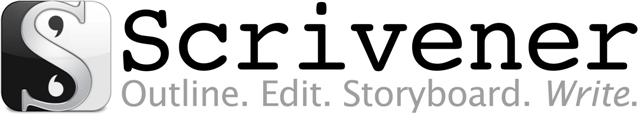
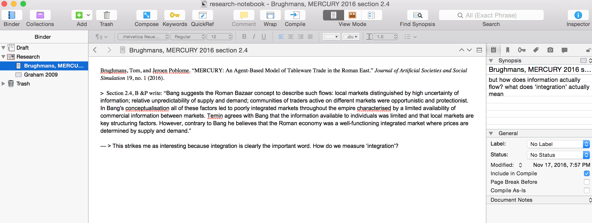
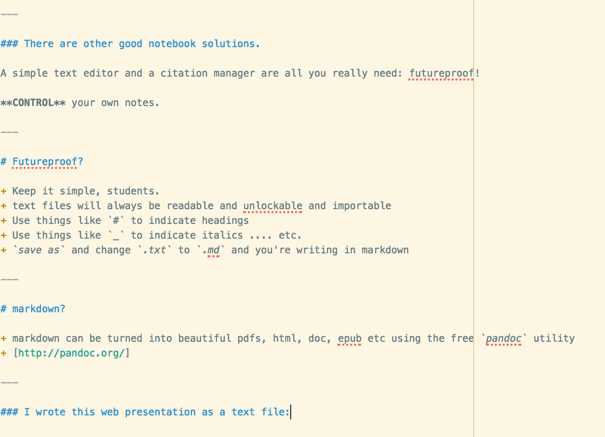
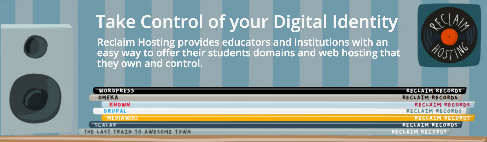
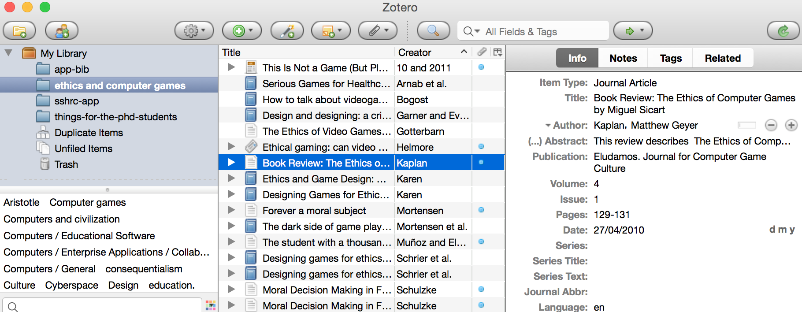

<section data-background="Laocoon_Pio-Clementino_Inv1059-1064-1067.jpg" data-state="blur">
<h1 style="color:black"> Ways to Avoid Being Eaten Alive   By Research</h1>
<h3 style="color:black">Tom, Iza, Shawn Follow along at http://bit.ly/cunov18</h3>
<small>grab [the source here](https://github.com/shawngraham/presentations/blob/gh-pages/cunov18.md)</small>
</section>
---

## The Plan for Today:

1. cite your software: what is your research environment? What is your workflow?
2. digital notebook management
3. citation management
4. bibliometric analysis

---

## take two minutes to consider: what is your workflow?

+ how do you write?
+ where do you make your notes?
+ what software do you _own_ versus _rent_?
+ are you the user or are you the product?
+ what software do you _need_ to achieve your research?
+ do you have a strategy for backing things up?
+ do you have a strategy for versioning?

_if there are ideas on this list that are foreign to you, we're here to help_

---

## software sustainability

---

## Control you notes.

Dual-entry notekeeping with Scrivener

---

(free to try, $40ish)

---

## There are other good notebook solutions.

A simple text editor and a citation manager are all you really need: futureproof!

**CONTROL** your own notes.

---

## Futureproof?

+ Keep it simple, students.
+ text files will always be readable and unlockable and importable
+ Use things like `#` to indicate headings
+ Use things like `_` to indicate italics .... etc.
+ `save as` and change `.txt` to `.md` and you're writing in markdown

---

## markdown?

+ markdown can be turned into beautiful pdfs, html, doc, epub etc using the free `pandoc` utility at [pandoc.org](http://pandoc.org/)

---

## I wrote this web presentation as a text file:

---

## Backing up

You use dropbox? That's fine. But it'd be better if you controlled your own data.

---

## Versioning?

Versioning is backing up so that you can rewind what the @#$%^ you did to your file

- no more `thesis.doc` ... `thesis1.doc`....`thesis1-final.doc`...`thesis-final-w-edits.doc`...`thesis1-with-final-edits.doc`...`finalthesisithink.doc`

- uses a piece of software called 'git' to take snapshots of your files.
- can be a bit tricky. Talk to me if interested

---

<section data-background="zotero_512x512x32.png">

<h2>Citation Management</h2>

FOR THE LOVE OF GOD GET AND LEARN TO USE A CITATION MANAGER

</section>

---

## bibliometric Analysis

- once you have a bibliography put together, you can begin to do some curious things indeed...

---
## For More Information

+ [The Historian's Macroscope](http://themacroscope.org)
+ [A workbook for crafting digital history](http://workbook.craftingdigitalhistory.ca)
+ [Introduction to Text Analysis, Brandon Walsh & Sarah Horowitz](https://bmw9t.gitbooks.io/introduction-to-text-analysis/content/)
+ [DH Questions and Answers](http://digitalhumanities.org/answers/)
+ [Open Notebook History](http://wcm1.web.rice.edu/open-notebook-history.html)
+ [Zotero](http://zotero.org)
+ [Reclaim Hosting](http://reclaimhosting.com)
+ [Electric Archaeology](http://electricarchaeology.ca)
+ [Scrivener](https://www.literatureandlatte.com/)

---

### AND TAKE THE CITATION MANAGEMENT WORKSHOPS!

Link: [MacOdrum Library](https://library.carleton.ca/help/citation-management)
