### _fail and loathing in east lansing_
## Failing Productively
### in Digital Archaeology

<small>Shawn Graham [@electricarchaeo](http://twitter.com/electricarchaeo)

Carleton University

_msudai 2016_

follow along at [http://j.mp/msudaifail](http://shawngraham.github.io/presentations/daifail.html#/)</small>

---
#### but first, a word from the Lord Commander

<iframe width="1120" height="630" src="https://www.youtube.com/embed/InTbHLzUMdA" frameborder="0" allowfullscreen></iframe>

---
<section data-background="failpics/3798461709_a6c4d7d3cf_b.jpg">

<div align="left"; style="background-color: grey; opacity: 0.8">
<h2 style="color:black">Structure of this talk</h2>
<ul style="color:black">
<li> A potted history of fail</li>
<li> Fail in academia</li>
<li> Parable of Heritage Crowd</li>
<li> A Tour of Fails in the Wild</li>
<li> A taxonomy of fails</li>
<li> Your blog posts</li>
<li> Imposter Syndrome & <br> Getting the Most out of Your Fails</li>
</ul>
</div>
---

<section data-background="https://c2.staticflickr.com/6/5477/11307026894_892ff39220_b.jpg">
<br><br><br><h2 style="color:black">A potted history of fail</h2>
</section>

---

## Prehistory of the idea of ‘fail’

> _Quod si deficiant vires, audacia certe <br> Laus erit: in magnis et voluisse sat est._ - Propertius

> πῆρά τοι μαθήσιος ἀρχά - Alcman

Note:
Free translation - so what if you fail? Boldness itself will be enough to win praise: in great endeavors it is enough to have tried.. Greek: Trying is the first step of learning. Alcman, 7th c BC Greek poet from Sparta

---

...actually, you get the idea. For as long as we've been human, there's always been someone saying, 'walk it off!'

---


---

## Fail as silicon valley ideology


Note:
This phrase in particular - fail better - seems to be the one that catches silicon valley's excitement. (Worstward Ho, 1983). operationalizing failure: prophets/profits of fail. The understanding of many tech startup folks that this is a license to burn through funding has caused a lot of harm (and indeed there are articles now in Forbes or WSJ pushing back against it). The tech folks failed to understand the humanistic implication of the phrase, and instead took it literally to mean 'a lack of success is itself the goal'. Fail!. But where does it come from? Let's start with 'fail fast'.

---

<div align="left">'Fast-Fail' <br> a module that checks the state of the system repeatedly for failure, stopping the operation and reporting back.

Note:

---

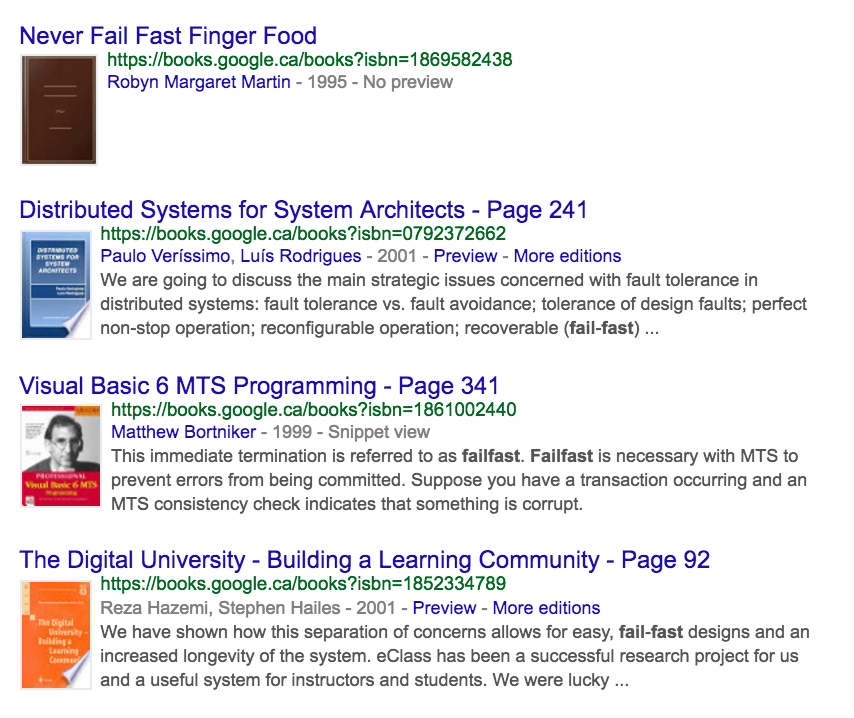

Note:
see the first use of fail-fast in education there? Seems to be the earliest use my cursory exploration has found of the 'fail fast' ideology moving out of tech to education. But this doesn't seem to be the idea that explodes into the 'fail' ideology

---

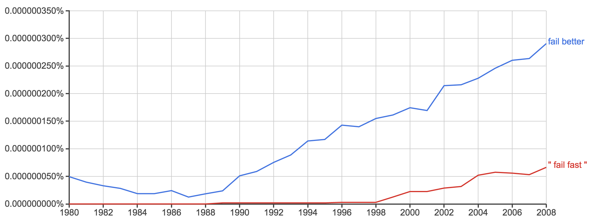

Note:
Earliest use of the 'fail better' idea that I can find outside the world of literature and criticism seems to occur during the first tech boom, where it turns up in everything from diet books to learning to play jazz, to technology: The Quest for a Unified Theory of Information. (Wolfgang Hofkirchner) That book according to google scholar, has been cited 13 times, but the things that cite it have themselves been cited over 600 times. I am merely speculating here on where this mantra of the fast fail, the fail better, comes from and how it spreads, but it would be a very interesting topic to explore.

---


---

...there's a bit of incoherence in the concept.

---
<table>
  <tr>
    <th></th>
    <th></th>
  </tr>
</table>

Note:
Connection of fail better, fail fast: perhaps what it really means is something akin to what Nassim Taleb called 'antifragility'. The fragile thing breaks under stress and randomness; the resilient thing stays the same; and the anti-fragile thing actually gets stronger as they are exposed to randomness. A kind of situation where 'whatever doesn't kill you makes you stronger' is true. Kids' bones for instance need to be exposed to shocks in order to get stronger. We'll come back to this idea, eventually, in the context of imposter syndrome.

---

# the zero-sum games of academia

<div align="left">Regardless of the origin or deep history of the productive fail, academia is set up deliberately to punish fail.<br><br>This is only starting to become widely recognized as a problem. <br><br>Start with the '[Everything is Fucked Syllabus](https://hardsci.wordpress.com/2016/08/11/everything-is-fucked-the-syllabus/)'
</div>

Note: academia's systems are 'fragile' in that they do not tolerate fail; they are to a degree resilient, but they are not 'antifragile' in Taleb's sense. The idea that 'fail' can break that which is 'fragile' is part of the issue here. So silicon valley really means 'fail' in the sense of 'antifragile' but they frequently forget that; academia sees 'fail' as the breaking of something fragile; and so the two are at loggerheads. *Aside* - my DH stuff is consequently viewed with suspicion, as is anyone who embarks on this whole digital archaeology path.

---

<section data-background="failpics/streamgraph-topics-20000.png">
<br><br><br><h2 style="color:black">Fail in the archaeological literature?</hr>

Note: Do we *ever* talk about research that *doesn’t* confirm an hypothesis? Do we *ever* try to replicate someone else’s study?
- 20 000 articles topic model
- No topic that explicitly deals with something *not* working
- This, despite the processual turn, where you might’ve expected such a beast!
- Nb, btw, the long prehistory of ‘digital’ type work in anglophone archaeology: even before the digital was invented, *digital habits of thought* existed. Perhaps these were a necessary precursor to enable digital work to happen in the first place
- I see on twitter where some folks fume against the ‘silverbacks’ in our profession who don’t see the value in all of this. Well, if any consolation, I imagine the silverbacks were probably worse back in the 50s or 60s when others were striking out in these directions in the first place. Perhaps it is small consolation, but: your work has a rich generational back story. You have roots! You have historiography! Never forget.

</section>
---

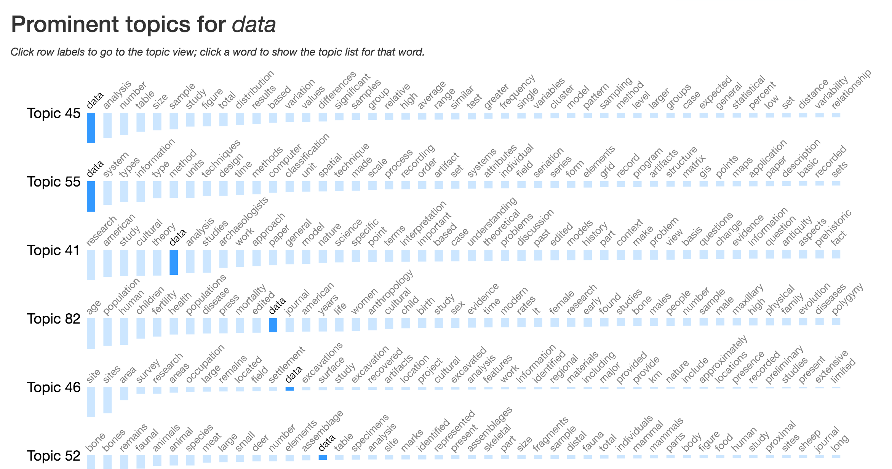

[Explore the corpus here](http://graeworks.net/digitalarchae/20000/)

--


--


--

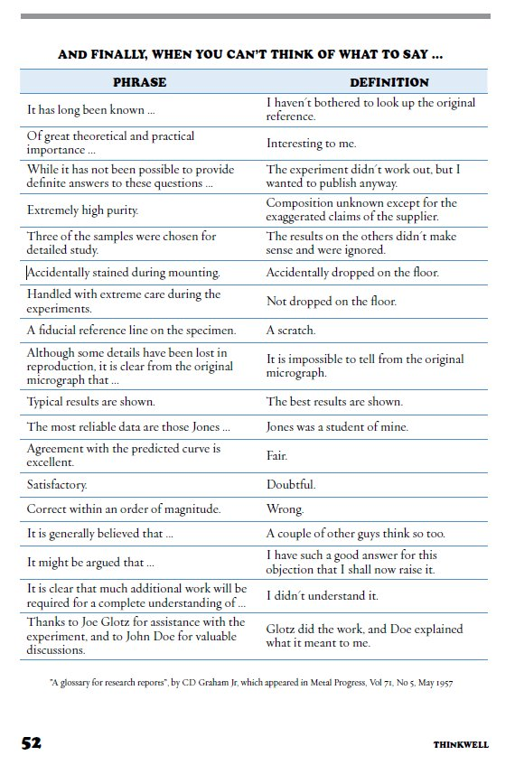

Note:
Framing fail in research & professional practice. tendency to spin, frame as win ; leads to inflated claims of success; to value fail means to not play the academic game as we currently find it.

---
<section data-background="failpics/11071988936_00e4e163b3_z.jpg">
.<br><br><br><br><br><br><br><br><br><br><br><br><br><br><h1 style="color:black">A Personal History of Fail</h1>

Note:
- Fail in research, like reporting the results of experiments that didn’t work, or that didn’t hit the right p-value, helps us answer the old question: _vale la pena?_ How would you know if something is worth exploring, if others don’t report back?

</section>
---
#### The parable of heritagecrowd

<table>
  <tr>
    <th></th>
    <th>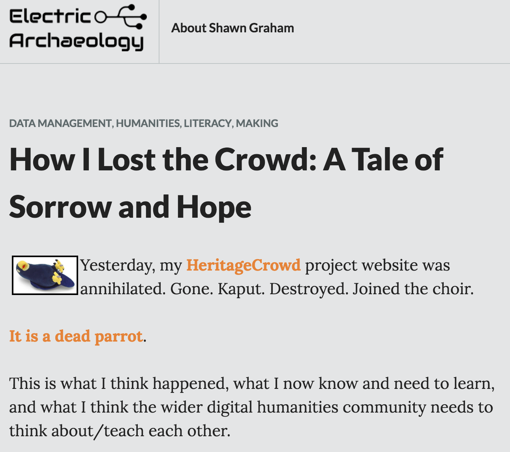</th>
  </tr>
</table>

Note:
- 2012. first a ‘win’ publication on thin evidence ; (contrast something I actually wrote with the academicese thing?
- You need my bio to understand where I was coming from:
--
## Who do you think you are, that you could talk about fail?

This was the question that confronted me when I started trying to deal with the fall out from my collapsed project.
<br><br><br>
My utterly, utterly, *dead* project.

Note:
- Trained as archaeologist, ceramic building materials: woo hoo.
- Most of my grad work as part of a research project in italy that jealously guarded its data, even between participants *within* the project (fear of being scooped) (my first *really* big fail: killing 3 months of work on the database)
- Unemployed
- Found work doing research for other people
- Began blogging to keep myself sane, to pretend to myself that I was *still* an archaeologist
	- Through that, found a group of people who *got* what I was doing. One of the first to engage with me there was Tom Brughmans (of Connected Past fame); the other was this guy named ‘Eric Kansa’
	- So for me, one way to combat my feelings of fail was to give away what I was doing. Another way of framing that is that I was committed to openness. But at that time - in 2006 - the web was  very different place. And I was a white guy on the internet, the ramifications of which I wouldn’t fully appreciate for some time to come.
- So when I actually snagged a job - as a digital humanitist, whatever the hell that was - my imposter syndrome was in high gear
- It was against that background that I developed & proposed the keritagecrowd project, as a way to try to resolve my imposter syndrome by doing a project that straddled my archaeological, digital, and now historical grounds
- And it failed.
--
## The Lunatick Moment

I found the answer in the community to which I wasn't sure I yet belonged.

<table>
  <tr>
    <th>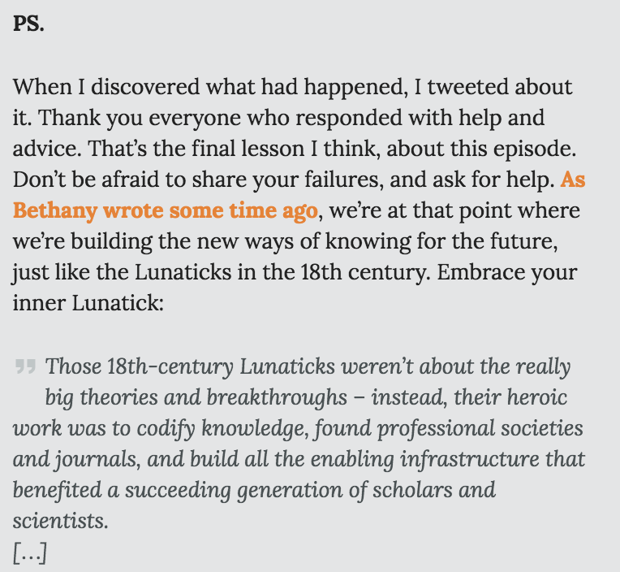</th>
    <th align="top">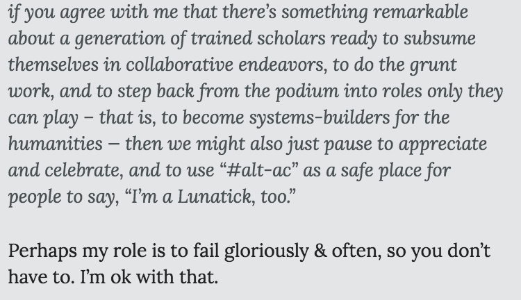</th>
  </tr>
</table>

Note:
-despair post & the response & the framing of what I was doing as perhaps more akin to Bethany’s ideas about our ‘lunatic’ moment. does that moment still exist? I hope it does
---
# Fails I have Known

Note:
So let’s talk about some other fails; some are mine, and some are volunteered to me via the kind people of the internet

--
## The Tiber Valley Project database

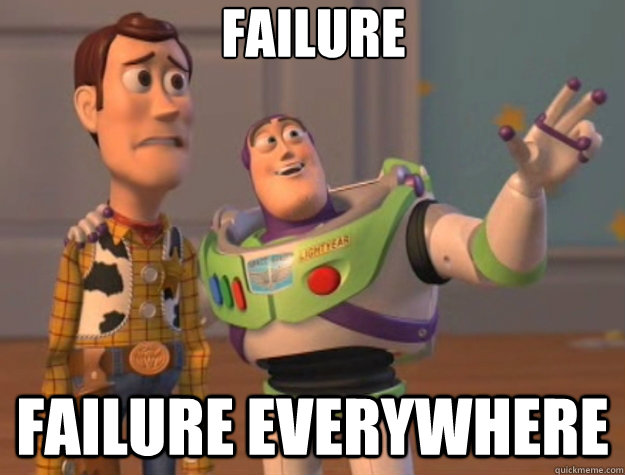

Note:
I 'fixed' a form, with disastrous results... This was not a glorious failure.
--
## My first glorious failure

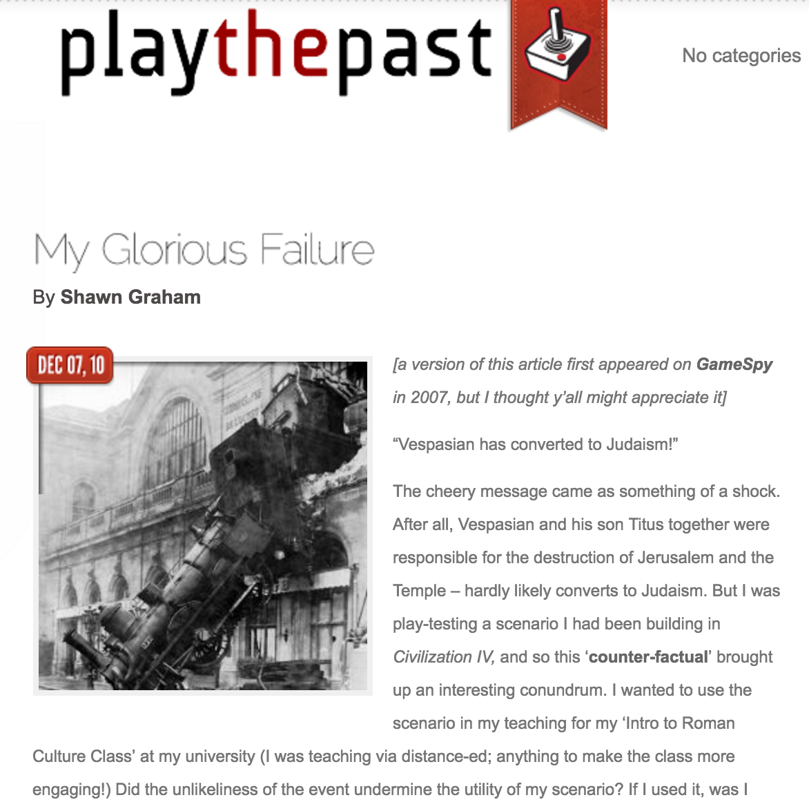

Note:
- Civ iv, my first glorious failure
- It was an utter flop. But I framed it as a win, in the first little wee piece I wrote on it
- I eventually came around to framing it as a success for the students *who participated* but a ‘teachable moment’ for my own development as a teacher
- Biggest issue was ‘creepy treehouse’ phenomenon, which I’ve since discovered in other guises, more on which in a moment (but in essence, the idea that there are ‘appropriate’ ways of using tech in teaching & research and woe betide the man who strays from the path of righteousness!

--

## The wikiblitz

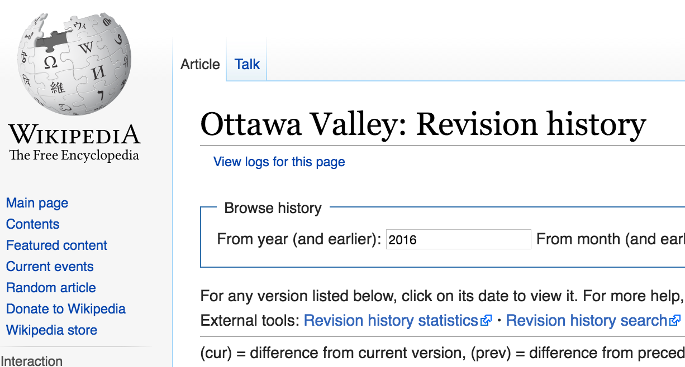

Note:
- Simple straightforward class assignment: let’s collaboratively update a wikipedia page on the history of our region, and see what happens next
- Idea to show how collaborative stigmergy can generate knowledge, a bottom up approach (but also looking at the demographics of who *actually* is engaged on wikipedia etc)
- Actual history majors all were ‘sick’ that day
- Fail.  (This is actually cited as a fail in some of the literature; I’m pleased & proud & but still human enough to experience a bit of disquiet)
--
## Stranger in these parts

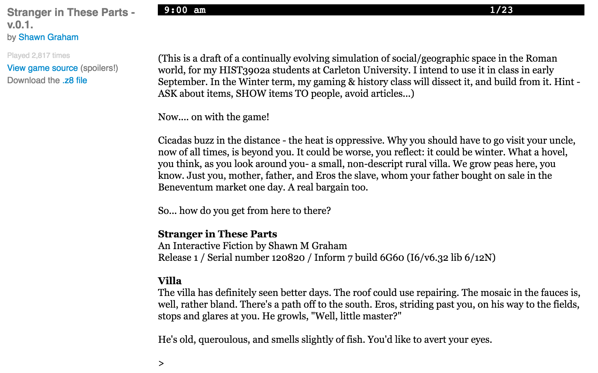

Note:
- Wrote an interactive fiction exploring the Romans’ conception of space
- Assigned it in class as a formal assessment piece (play the game, write a reflection on how this experience jives or not with your academic readings about space and spatial economy of the roman world)
- Result: UPROAR. ‘How do I get an A?’ , <- actual quote
- Fail
--
## AR for Enviro History

<iframe width="840" height="630" src="https://www.youtube.com/embed/im87OLTq-9g" frameborder="0" allowfullscreen></iframe>

Note:
- Whole class was predicated on the idea, ‘how do we use augmented reality to tell history?’
- Results: https://www.youtube.com/watch?v=im87OLTq-9g
- WORST COURSE EVALUATIONS EVER <- the ‘if the tech doesn’t work, will I fail?’ fear and the idea that this was all an experiment were too great to overcome the conditioning of our students, the all-or-nothing experience
… But I bet if I did this now, with Pokemon Go in the aether, we might have a different experience…
--
## Use Cases with FAIMS
courtesy Adela Sobotkova


(nb: FAIMS is not a fail)

Note:
- Sobotkvoa sent me a copy of her paper
- Faims a paperless recording system for archaeology
- From their own case studies, they encountered a number of fails in their early days
- Chief amongst these: things work in the lab that never work in the field; that no matter how much you think you’ve tested for every possibility, shit still happens
--
## Iroquoian Longhouse
courtesy Michael Carter
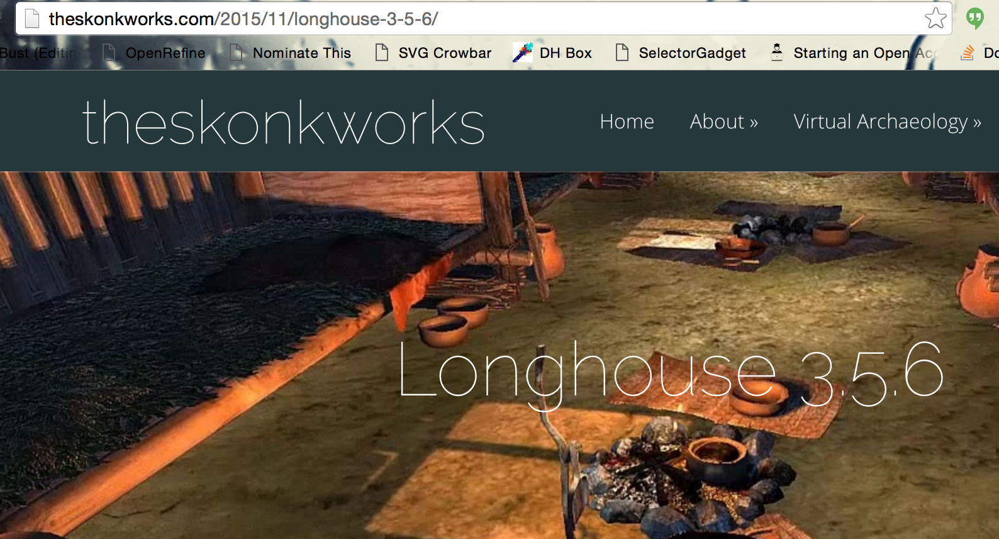

Note:
- Trying to procedurally model & animate an Iroquoian Longhouse
- Procedural modelling - which relies on understanding the actual processes & rules-of-thumb that Iroquoian builders used to build longhouses - highlighted, with each failed reconstruction, just how much we had taken for granted or glided over in our understanding of these structures & the social implications of the spaces inside
--
## Palmyrene Arch in Trafalgar Square

<table>
  <tr>
    <th>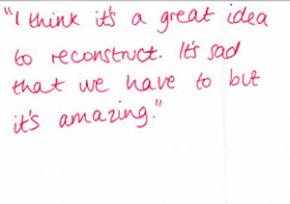</th>
    <th></th>
    <th></th>
  </tr>
</table>
Card courtesy Zena Kamash; Tweet courtesy Gabe Moshenska


Note:
- Whether or not this qualifies as a fail depends on who you talk to
- Archaeologists should understand the ramifications of space, no excuse, right?
- Laser cutting of stone blocks to make a miniature representation of the arch, as a way of ‘saving’ palmyrene archaeology
- This also is a fail in that it cemented in many minds the idea that digital archaeology is merely about gadgets and gee-whiz look at what I we can do
-Finally, it's a fail on moral and ethical grounds, I think. It’s one thing to record and reconstruct destroyed material, digitally & virtually, and quite another to reconstruct something that has been destroyed in war time and while that war continues to place it at the epicentre of British imperialism, Trafalgar Square. What kind of message does that send out? It implies that Palmyrene archaeology, culture, and heritage is ‘ours’ in a way that it isn’t that of the Syrians living in the modern town of Palmyra. Who’s best able to look after it, the reconstruction seems to ask – and the implied answer is, not those folks who aren’t us Westerners. There’s a long history of states appropriating ancient culture for modern propaganda. Who does this reconstruction actually help? At the time of its unveiling, it leant support and moral cover for Assad’s regime – agents of which have themselves been responsible for much looting and destruction. Not only that, but when you examine this 'institute of digital archaeology', you'll find that nothing is public domain, nothing is open access; as Eric remarked to me once, it's 'heritage for the 1%'.

---
## A taxonomy of fails

1 - Technological Failure<br>
2 - Human Failure<br>
3 - Failure as Artifact<br>
4 - Failure as Epistemology<br>
<p class="fragment fade-up">5 - Failing to Reflect</p>

Note:
Cornell and Warnick, working from the perspective of digital pedagogy, identify 4 kinds of fail
1-4, with examples - one thing not mentioned in any of this is the whiteness and maleness of the internet, and of internet culture. It might be that everything I’m saying is impossibly tainted by the fact I’m a white guy in tech: and I don’t have the necessary perspective to work out whether or not what I’m saying is dangerous or not.
-The first two refer to what happened; the second two refer to our response and how we react to the first two (*if* we react at all). Perhaps there should be a 5th category: 5 - failing to reflect.
--

## Classifying & Valorizing Fail

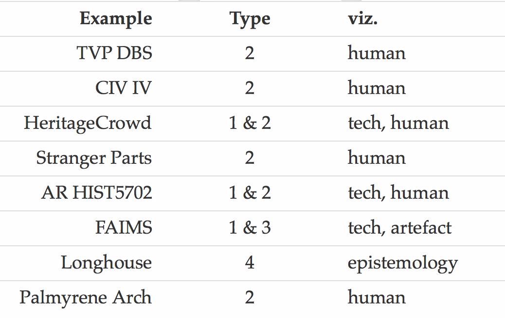

Note:
-You might classify these differently
-Once we’ve understood the kind of fail we’re dealing with, we can draw the productive lesson! (Which moves us from all those 1s and 2s to 3s and 4s)
-That’s the value of fail; a pedagogy of fail draws from this; it makes it safe to try things out. It makes a framework for process, rather than product.
-It makes sharing what works and what doesn't part of the process. It makes knowledge!

--

## Credo

_I believe that digital archaeology is defined by productive, pedagogical fail_ <br><br>
_I believe that this pedagogical aspect of digital archaeology makes it public archaeology_ <br><br>
_I believe that failing in public is the most powerful thing that digital archaeology offers_ <br><br>

Note:
Thus, fundamentally, I believe that digital archaeology is so entwined with fail, that digital projects necessarily must have a pedagogical aspect to them; and once we’re talking pedagogy, I believe we’re also talking public archaeology. Even Open Context, which is about as different from these examples as anything digital could be, incorporates the pedagogical into it because it includes recipes and how-to for how to use it: it anticipates fail in its users and gives them the framework for dealing with it!

---

<section data-background="failpics/3799287378_b94e81e307_b.jpg">
</section>

---

## γνῶθι σεαυτόν

- what are the nature of your own fails?
  - reflect on a ‘fail’ that happened this past year.

Where might it fit on the taxonomy?

Note:
share with your neighbour.How do you change the fail from a type 1 or 2 to a 3 or 4? Share your thoughts with the closest pair, repeat.
---
# Distant Reading the last 12 Months

- word vectors; topics; what does this tell us about your relationship to fail?

- You’ve all just spent some time talking about your own fails & the lessons you’ve drawn: do your project blog posts reflect any of that? Let’s just take a few quick moments to have a distant read

<small> You can view the R notebook for yourself, replicate and extend the analysis at [my repo](https://github.com/shawngraham/jupyter-notebooks)</small>
--

```r
nearest_to(blogmodel,blogmodel[["i"]])
```

<div align="left">"shift" "frustrating" "my" "helped" "seemed" "nunaliit" "learning" "went" "lists" "going" "good" "initial" "hoping" "getting" "bit" "thinking" "i’ve" "edit" "head" "advice" "pro" "me" "i" "permissions" "to" "mina" "beginning" "get" "i'm" "tutorials" "design" "try" "filemaker" "been" "started" "got" "i've" "experimenting" "existing" "isn't" "software" "don't" "unfortunately" "news" "back" "own" "continuing" "actual" "quite" "figure"</div>


--

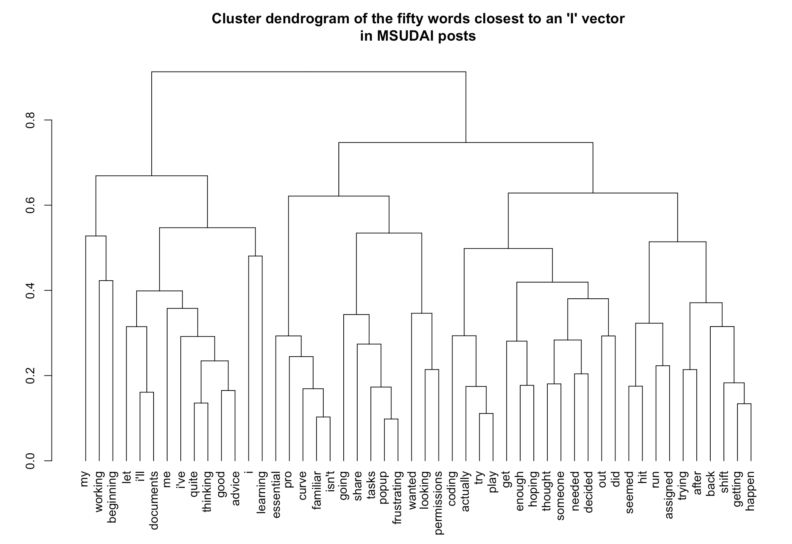


Note:
- Nothing explicitly in the corpus as a whole surfaces as being about fail
- But there are definitely hints of frustration!
- ‘I’ vector - note groups of words that seem to be about when things aren’t working
*Find an image, ghostbusters (new), crossing the streams.*
</section>
--
## Rage against the Machine

```r
fail_vector = blogmodel[[c("easy","does","can","able","easily")]]-blogmodel[[c("cannot","unable","hard","doesn't")]]
```

```r
us_vector = blogmodel[[c("I","me")]] - blogmodel[[c("it")]]
```

Note:
-So I wondered to myself, how might I explore this further? I wondered if I could map the way y’all were speaking about your own work, in opposition to the machine. That is to say, to operationalize how ‘imposter syndrome’ might rear its ugly head
-So I tried this: I crossed the streams of a vector that ran from things that were easy to do to things that were hard to do, against a vector that ran from ‘I’ to ‘it’. This aint’ perfect, but I figured it might tell us something useful.

--

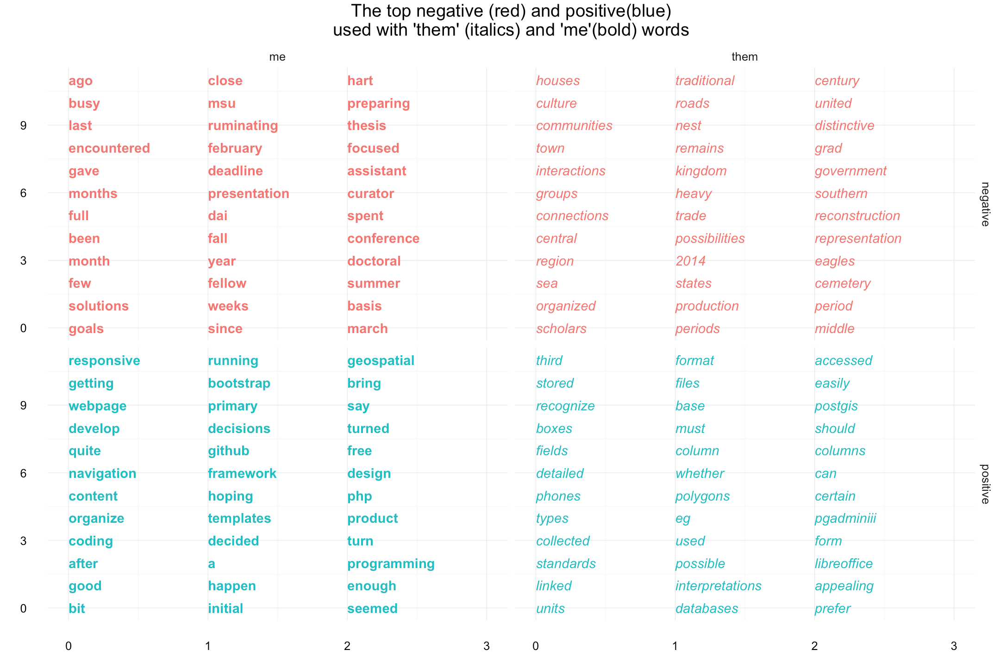

Note:
-Negative I words? They seem to be tied to the confessional nature of the project blog posts: forgive me Ethan, for I have sinned. It has been two weeks since my last blog post…
-Negative ‘it’ words? These seem to be (pending a close reading) connected with the larger systems  (professional & scholarly apparatus) within which we are meshed. Fighting the machine, as it were.
-Positive I words? Bootstrap! Templates! Running! Design! Programming! Y’all seem to be having success there.
-Negative ‘it’ words? Databases. Forms. Libreoffice….
-So, it looks to me like ‘fail’ is in there, it’s just hiding as type 1. And perhaps, if I can get all meta for a moment, this chart could be considered a type 4 fail in that we are using ‘fail’ as an epistemology to understand better whether or not MSUDAI is actually achieving its goals. If the value of fail is as I described it a few moments ago, then we need all of us to work harder at the public side of fail, and of moving from types 1 and 2 to 3 and 4. As our discussion a moment ago demonstrates, you’re already there: but this is where imposter syndrome could be holding us back. We are (rightfully) loathe to discuss ‘fail’ in public for fear that we might be revealed to be the imposters we all know we are at heart.

--

## topic change over time

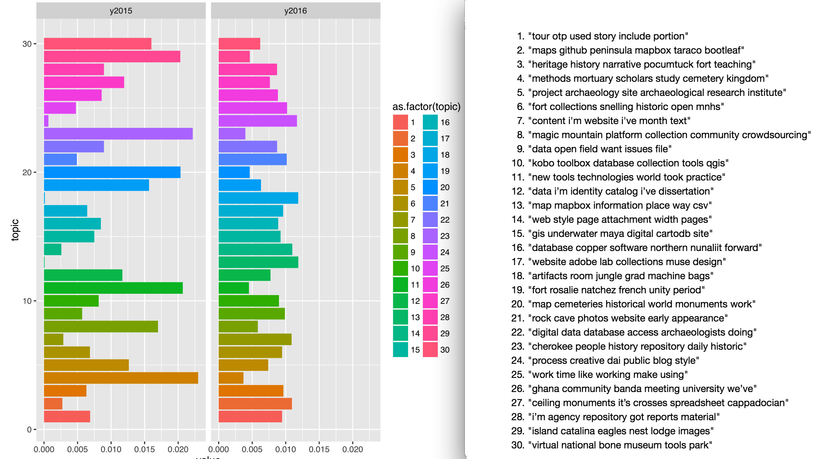

Note:
Not word vectors; LDA topic model. 24, 25, 7, and 11 are the topics that I identify as being (probably) related to ideas of 'fail' and getting past imposter syndrome, of getting comfortable with digital archaeology. What do you think? What should we make of their seeming increase?

--

I could be wrong.

You can see for yourself: [https://github.com/shawngraham/jupyter-notebooks](https://github.com/shawngraham/jupyter-notebooks)

---

## a fail shared is not a failure

Note:
+ A fail shared is not a failure
+ A fail shared lets us all move forward
+ Githb + Fail Log + DOI means you still are winning

--

## Hierarchy of Reproducibility

<small> or ways to share fails well </small>

(from Marwick's [Primer on Reproducible Research](http://benmarwick.github.io/CSSS-Primer-Reproducible-Research/#/31))

+ **Good**: Use code with an integrated development environment (IDE). Minimize pointing and clicking (RStudio)
+ **Better**: Use version control. Help yourself keep track of changes, fix bugs and improve project management (RStudio & Git & GitHub or BitBucket)
+ **Best**: Use embedded narrative and code to explicitly link code, text and data, save yourself time, save reviewers time, improve your code. (RStudio & Git & GitHub or BitBucket & rmarkdown & knitr & data repository)

--

## Frankly, Ben Marwick is Awesome

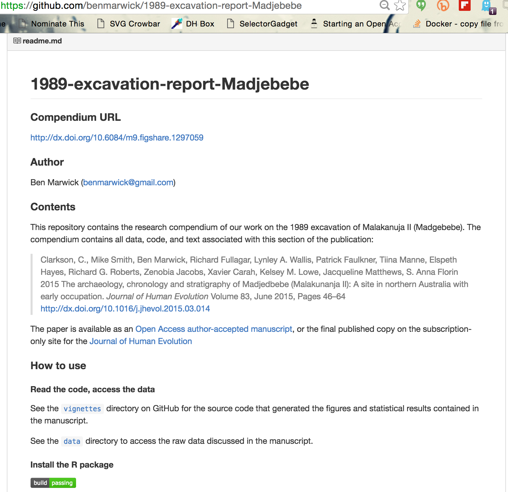

--

Few of us are at that stage. What we can do:
<br>

- each experiment|project gets its own folder
- each experiment|project has subfolders `data` and `figures` and `text` and `bib` etc
- keep the experiments|projects under version control.
- submit the repository to [zenodo](http://zenodo.org) or similar to obtain DOIs.
- write as you go, on a fail log or blog or what-have-you. Get DOI for this, too.

<br>
...and in this way fail sneaks into the game of being an academic: citations the coin of the realm.
--


--


Note the arrow and bar at right. [Hypothesis](http://hypothes.is) integrated to allow pubic, private, and group annotations (& each annotation has its own url, too)

--

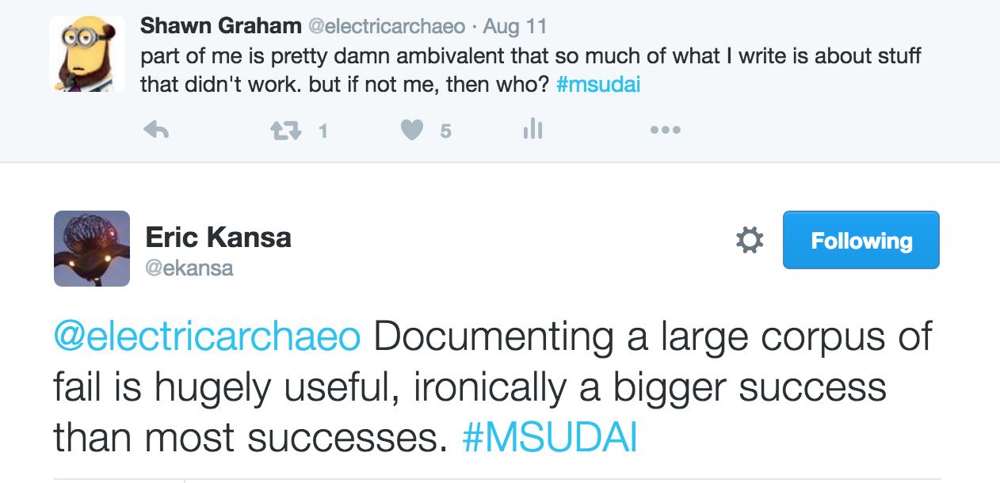

Note:
Sharing my fails in public has led to more opportunities for me than I could ever have imagined.

---

<section data-background="http://static3.businessinsider.com/image/5281365cecad04a24735bc8b-1190-625/the-imposter-syndrome-is-more-common-than-you-think.jpg">

<div style="background-color: grey; opacity: 0.9">My name is Shawn Graham, and I am an imposter.</div>

Note:I have been faking since 1997. Every friggin’ day I’m terrified that today will be the day when someone actually says, you’re not actually an archaeologist, you’re not actually a digital humanist.
Actually, that *did* in fact happen to me in the feedback on a grant about three years ago. ‘Graham isn’t really an archaeologist, he just writes about the communication of archaeology’. And you know what? Assholes will ever be with us. The reviewer wrote that… but no one took my job. No one fired me. No one paid that arse any heed (well, except for me, because, you know, I’m human). We still won a bit of money for that project. Fuck you dude.
Here’s the thing about imposter syndrome:
- relationship of fail to imposter syndrome: if you feel that imposter syndrome is rearing its ugly head, it can be argued that what’s happening is that you’re actually learning; idiots always assume more competence than they actually have, so the inverse….? proximal zone of development

</section>

---
<section data-background="http://pre13.deviantart.net/7f86/th/pre/i/2012/133/c/9/tiffany_aching_by_margaritkad-d4zn4xl.jpg">
<br><br><br><br><br><br><br><br><br><br>
<div align="left"; style="background-color: grey; opacity: 0.8">
<h3 style="color:black">To Fail Productively in Digital Archaeology</h3>
<h2 style="color:black">Be Like Tiffany Aching<h2>
<ol style="color:black; font-size: 28px;">
<li>Think about what kind of fail you're dealing with. (Types 1 & 2)</li>
<li>Think about how you're reacting to that fail. (Types 3 & 4)</li>
<li>Reflect on that reaction</li>
<li>Write it down where we can find it and read it!</li>
</ol>
<small>'Tiffany Aching' by [MargaritkaD](http://www.deviantart.com/art/Tiffany-Aching-301730745)</small>
</div>

Note:
- We are all of us members of the Lunartick Society. We are all of us building the possibility space for those who come after.
- make it so that others can retrace your steps; even a partial step forward is a step forward! -when you find someone struggling, give positive & meaningful feedback; be open about your own struggles; get validation of your skills if necessary - work through a code academy tutorial, or lynda.com: a badge or other visual/tangible reminder of what you can do. - build things that make you feel good about your work into your work. - figure out what time of day & in what circumstances flow happens, and block that time out (h/t Jo Van Every Meeting with Your Writing - I’d also recommend doing this - writing is simply craft, so you could use it for your project work etc) - find your tribe (I used to say, work in the open, but given the dangers to your own safety - i’m a white dude- if your group works within slack, or within a closed Facebook group, or a forum, or where’er, then that’s good. Surround yourself with people who get it. When I was in the wilderness, in 06, blogging gave me that community that allowed me to become whatever this is.
-You’re all of you digital archaeologists. You are leaders in your field. You do work that leaves me in awe. I can’t wait to see what you do next.

</section>

---
### Thank You

Ethan & Lynne & the NEH

<small>Shawn Graham [@electricarchaeo](http://twitter.com/electricarchaeo)</small>

[credits](daifailcredits.md)
