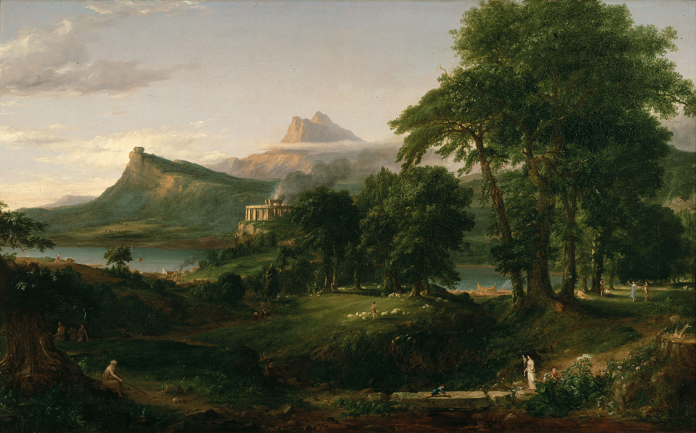

# Big Data Gothic

### Draft

---

###[The Gothic] aimed to produce emotionally vertiginous shocks and thrills;  sensations of any kind, in fact, so long as they put the viewing subject - the 'Self' - at the centre of the experience.
 Richard Marggraf Turley

---

#### "The goal  was to  overwhelm  the senses,  to annihilate  'Self'."
<section data-background="wanderer.jpg">
</section>

---

The world of information is more Gothic than its believers believe, because it is ghostly, silhouette-like, deprived of human sentience.
 Arnold Weinstein

---

examples of techno utopian stuff, obliterating self

---

Kurzweil, obviously

---

Big data, like the Gothic, lacks context

---

Correlations are not context.

---

Archaeology, Ethnography, History....  the humanities are about context.

---

Thick Data vs Big Data

https://medium.com/ethnography-matters/why-big-data-needs-thick-data-b4b3e75e3d7#.6docngys8

---

Digital Humanities provides the tools for understanding shifting scales

---

Depth

---

"People are getting caught up on the quantity side of the equation rather than the quality of the business insights that analytics can unearth". - Steve Maxwell

---

## Big Data Gothic
+ sublimates the self
+ revels in the glory of the [data] landscape
+ exults in the terror of it all

---

<section data-background="http://cdn.arstechnica.net/wp-content/uploads/sites/3/2016/02/drone-on-tarmac-640x413.jpg"></section>
Note:
Skynet + lives as rounding errors
https://theintercept.com/document/2015/05/08/skynet-courier/
http://arstechnica.co.uk/security/2016/02/the-nsas-skynet-program-may-be-killing-thousands-of-innocent-people/

---

## Frankenstein's Monster
sometimes, things are cliches because they are fundamentally _true_.
