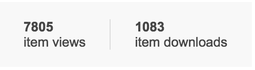
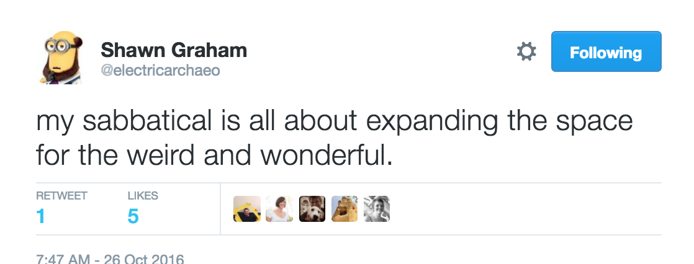
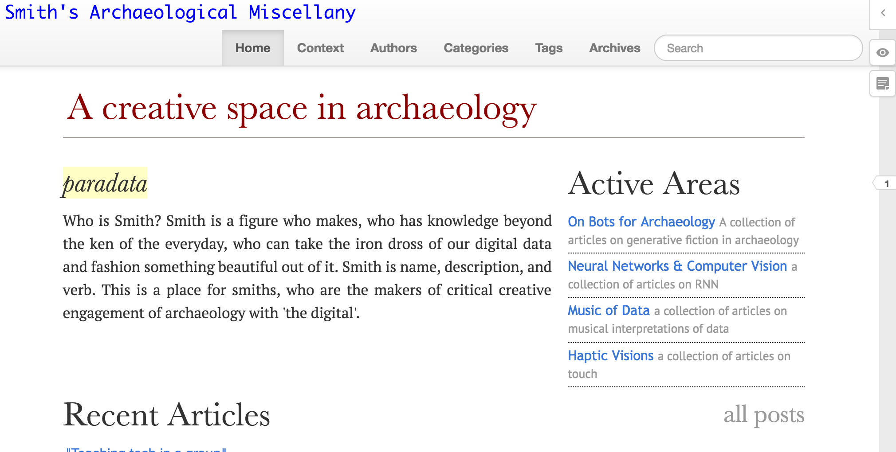

<section data-background="https://c2.staticflickr.com/4/3748/11130870514_0ee2072c19_b.jpg">
   <h2 style="color:black">.    
OA & Me
</h2>
<h4 style="color:black">follow along at j.mp/oa-me</h4>
</section>

---

Shawn Graham 
@electricarchaeo 
electricarchaeology.ca 

---

+ in my teaching

+ in my research

+ in my daily use of tech

+ in my failures

---

But first, a video.

---

<iframe width="1120" height="630" src="https://www.youtube.com/embed/kYnXOxpcgRM" frameborder="0" allowfullscreen></iframe>

---

The great shame of archaeology: no one ever resuses the primary data. 

That contest is our attempt at trying to rectify that.

---

I know the shame of having files that nobody will ever see.

---

Of sitting on data that might  - somehow -  - in ways I can't quite imagine yet -  be useful to somebody else.

---

<section data-background="https://c2.staticflickr.com/6/5497/11157391824_8676985ea7_h.jpg">
</section>

---

<section data-background="figsharebackground.png">
<h3 style="color:black">I started putting all my data out there on figshare.</h3>

</section>

---

I made darn sure that people could find my written stuff.

---

...which I plumbed into Scopus, into Figshare, into Google Scholar.   If it plumbs together, I plumbed it good.

---
<section data-background="https://c2.staticflickr.com/6/5547/11300107675_13c9d40ea6_b.jpg">
</section>
Note: the thing about doing that is that you quickly get a sense of which of your works people actually read. And how they read it. Certain of my papers I've discovered are useful literature review padding. Note also- I've committed to stop reviewing for Elsevier owned journals. This is not without personal cost.

---

## what about teaching?

---

+ haven't ordered a textbook once, in six years at Carleton, for any of my classes
+ *every* class uses resources that can be had from the open web or from the library

---
<section data-background="craftingbook.png">
<h2 style="color:black" align="right">I even wrote my own damn open access workbook for one class that needed it.</h2>
</section>
---
+ students are encouraged to take copies of it 
+ some students even re-wrote parts of it

---
<section data-background="daea.png">
</section>
---

## what about research?

---
+ What is it, _exactly_ that I actually do?

---
<section data-background="opennotebook.png">
<h2 style="color:black">An open research [notebook](http://smgprojects.github.io)</h2>
</section>
---
<section data-background="blog.png">
<h2 style="color:black" align="right">Sometimes, you have to [write](http://electricarchaeology.ca) your notes up</h2>
</section>
---
<section data-background="twitterpage.png">

</section>
Note: you can be really open in your practice if you tweet every bloody thought that comes into your head, as I do.
---
<section data-background="tinyarchae.png">
<h2 style="color:black">  scholarship as performance art</h2>
</section>
Note: use of open source, open access materials

---
## writing in public without a net

http://themacroscope.org

---

## expanding the space

---
## So. About Shawn.
+ trying to make OA and Open Source a habit of mind
  + for my self
  + for my students
  + my colleagues
---
+ trying to expand the possibility space for what we do
  + places we publish
  + what 'publishing' might mean
  + that data is itself publishable
---
### this is necessarily political

---
<section data-background="https://c2.staticflickr.com/4/3808/11295235284_fdfe5a7f01_b.jpg">
<h2 style="color:black">privilege 
  & 
 failing in public</h2>

Note:
and I'm a white guy on the internet.
if I want others to try this even a little bit, I have to go big. I gotta make it safe to try stuff, safe to fail. I have to figure out what works and what doesn't, because other people are not in a position to make mistakes. They have to get it right the first time.
</section>

---

### oa & me. 
## it's complicated.

---
### thanks
#### @electricarchaeo
+ background images from the [British Library Flickr](https://www.flickr.com/photos/britishlibrary/) set of copyright-free images.

+ find the source for this presentation at [http://github.com/shawngraham/presentations/oa.md](http://github.com/shawngraham/presentations/oa.md)

---
<small><small>
 Image taken from page 143 of 'When Life is Young: a collection of verse for boys and girls' 
 Title: "When Life is Young: a collection of verse for boys and girls"
 Author: DODGE, Mary Elizabeth.
 
 Image taken from page 108 of 'Na úsvitě nové doby. Dějiny roku 1848. v zemích českých. [With illustrations, including  portraits and facsimiles.]' 
 Title: "Na úsvitě nové doby. Dějiny roku 1848. v zemích českých. [With illustrations, including portraits and facsimiles.]"
 Author: TOUŽIMSKÝ, Josef Jakub.
 
 Image taken from page 25 of 'A Woman's Courage ... originally published under the title of “Golden Lives,” etc' 
 Title: "A Woman's Courage ... originally published under the title of “Golden Lives,” etc", "Golden Lives: the story of a woman's courage"
 Author: WICKS, Frederick.
 
 Image taken from page 128 of 'The Pirate's Hand. A romance of heredity. By the author of “Kneecapped” ... Edited by C. Graves, etc.' 
 Title: "The Pirate's Hand. A romance of heredity. By the author of “Kneecapped” ... Edited by C. Graves, etc."
 Author: GRAVES, Clotilda Inez Mary.
 
 Image taken from page 8 of '[The Works of Lord Byron. A new, revised and enlarged edition, with illustrations [including portraits].]' 
 Title: "[The Works of Lord Byron. A new, revised and enlarged edition, with illustrations [including portraits].]", "Works"
 Author: Byron, George Gordon Byron - Baron
