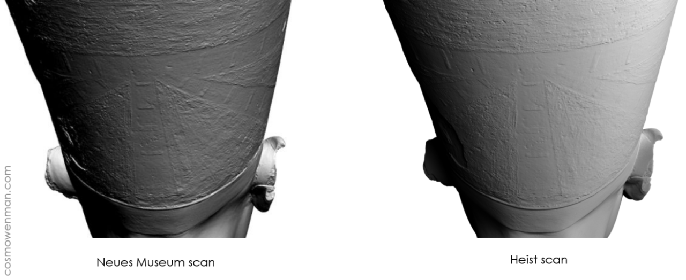
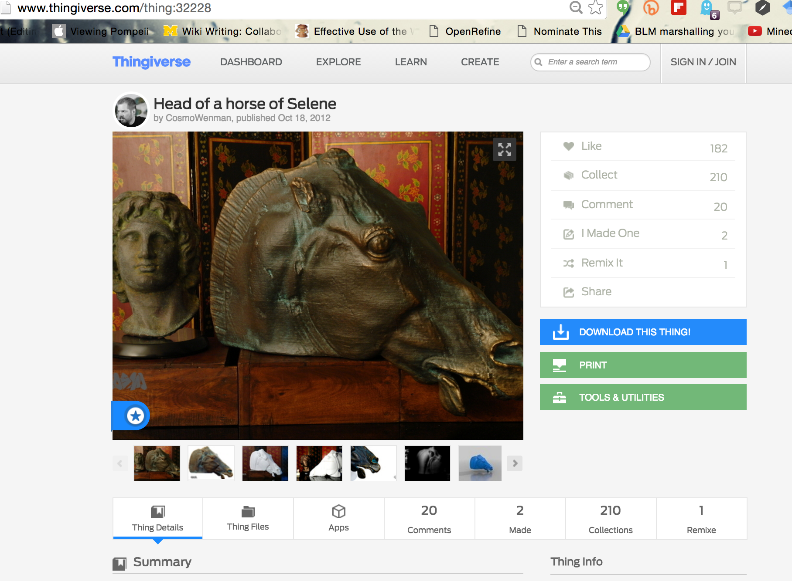
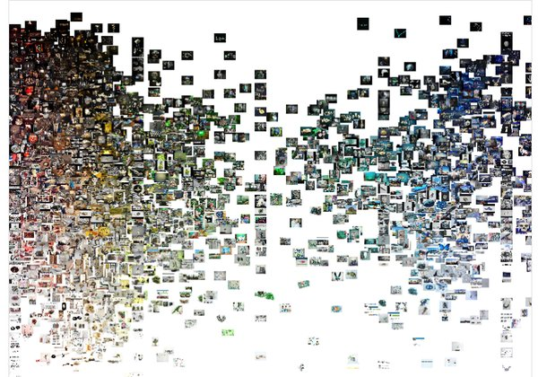
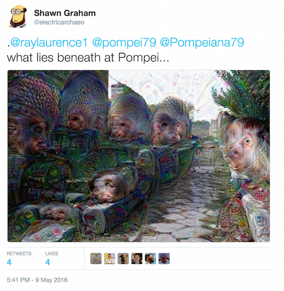

# ArchaeoGlitching

_or_

## ...blurring analog to digital to analog to digital to analog...

_or_

### digital archaeology as a process of databending

_or_

#### there's nothing to which the prefix 'archaeo' can't be added

<small> Follow along at [http://j.mp/sg-glitch](http://j.mp/sg-glitch)</small>
---

#### the plan
+ a bit about glitch
+ glitch and aura and replication
+ glitching as a way of exploring the bone trade
  + soundbashing images, 3d printing Instagram

---

<section data-background="http://67.media.tumblr.com/cb29e3226d913336a24d9735dee9bf13/tumblr_inline_mzf1diAeod1r11yps.png">
</section>

Note: the problem of 'aura'. glitch solves this

---

<iframe width="560" height="315" src="https://www.youtube.com/embed/Rr12u1tk_rM" frameborder="0" allowfullscreen></iframe>

If digital transcoding seeks always to reconstitute itself in a proper way, then glitch is an instance in which analog punks digital. - [Manon & Temkin 2011](http://www.worldpicturejournal.com/WP_6/Manon.html)
</section>

---

### The Materiality of the digital

|  |  |
|---------------------------------------------------------------------------------------------|------------------------------------------------------------------------------------------|

--

Worth remembering that all digital data is, ultimately, in physical form _somewhere_

--

Physical things can be liberated.

--

'the past' reconstituted in a proper way
</section>

---

## Data theft as punking the museum

--

Note: Nora Al-Badri and Jan Nikolai Nelles; 'kinect hack' Neues Museum Berlin

--

--

--

<iframe src="http://playcanv.as/p/995ac005" width="800" height="800"></iframe>

---

The Palmyrene arch

Note: look at the associations of space within trafalgar square, too

--

--

- a digital colonialism?
- an argument in support of Assad?
- digital tech is never _neutral_

---

'Replication as a way of knowing in the digital humanities'

- title of talk [by Geoffrey Rockwell](http://www.germanistik.uni-wuerzburg.de/lehrstuehle/computerphilologie/aktuelles/meldungen/single/artikel/abendvortrag-replication-as-a-way-of-knowing-in-the-digital-humanities/)

--

That's a very archaeological sentiment, yes?

--

> When glitches manifest, they are a sudden phenomenological intrusion, a break in the order of logic - [Manon & Temkin 2011](http://www.worldpicturejournal.com/WP_6/Manon.html)

---

- archaeological data are meaningful insofar as they have context
- is a scan (whatever its 'reality') meaningful, archaeologically?

Note: I'm thinking 3d scans of objects in the present are archaeologically meaningful only within the archaeological present

--

Well, maybe.

--

--

Note: 2013 consumer electronics show- was on display. visually impaired, touching, etc. For that person, it had 'aura' in a way the look-but-don't-touch of the BM can't. Thus aura is dependent on sense. also note the 'remix' count, that someone was taking this apart to make something new.

--

Note: BM making things downloadable now; 2.5k downloads on this one alone. No need to heist?

---

- Smearing from the physical into the digital: we get it. It makes 'sense'.
  

- We call it 'digitization'

---

#Aura happens when we glitch.
  
- When we smear from the digital into the physical.
  
- When we have to use a different sense to _make sense_.

--

> Digital data does not contain its own interpretation...Glitch art is a refusal to submit to this intended interpretation [Manon & Temkin 2011](http://www.worldpicturejournal.com/WP_6/Manon.html)

---

Ok, bear with me. I'm going to deliberately glitch some stuff.

First, some background.

---

### Buying and Selling Human Remains on Instagram

<small> Damien Huffer, principle investigator</small>

Note:
Thus, I'm using glitch art or databending as a way of understanding this trade. I look at the language of the associated comments as a physical landscape (word vectors). I look at them as bags of words (topic models). I wonder about colour, hue, and saturation as perhaps signalling something in these pictures that the comments don't reveal.
--

### 9000 images scraped last month

Note: human bones, human skulls, context-less, literal things. turned into digital images for ease of trade. often not with any other meta data than a tag #humanbone or #humanskull; how do these people signal that something is for sale? Sometimes, quite baldly stating:

--

--

Note: clearly, there is something going on. This is hue v. saturation.

---

### Blurring to create intelligibility

<small> - Tara Copplestone </small>

Note:
photobashing ... occupies a liminal position in archae because it puts 'something captured through a mechanical process through a subjective one'
Value in it- because it 'sit[s] at an intersection of subjective processes and mechanical capture, allows for some interesting interactions and reflexivity between both sides of this discussion'. Photobashing is deformation.

--

So here's where the glitch happens. It's a glitch of proper scholarly methods.

--

- Hue, Colour, Saturation.
- 3 notes. A chord.
- Sound?

--

Note: we fill in gaps in the sound with our expectations. Consider this video where the mp3 has been converted to MIDI back to mp3; the music has been ‘flattened’ so that all sonic information is being played by one instrument. (Generating this effect is rather like saving a webpage as .txt, opening it in Word, and then resaving it as .html). All sounds (including vocals) have been translated to their corresponding note values, and then turned back into an mp3. It is noisy; yet we perceive meaning…  If we sonify our data, and begin to hear patterns in the sound, or odd outliers, our cultural expectations about how music works (our memories of similar snippets of music, heard in particular contexts) are going to colour our interpretation. This I would argue is true about all representations of the past, but sonifying is just odd enough to our regular methods that this self-awareness will help us identify or communicate the critical patterns in the (data of the) past.

--

[Human Bone Song](https://soundcloud.com/shawn-graham-60451318/humanbonesong)

--

- Hue, Colour, Saturation.
- 3 axes. Space.
- Volume?

--

- Same data, represented in 3d space

---

# Glitch Blur Blend Break               .
<section data-background="https://farm8.staticflickr.com/7188/6786558606_24bf54c04c_o_d.jpg">
Note:Digitization, smearing back and forth from analogue to digital and back - it's not about the object itself. It's what it does to how I think that matters. It's a method to think about a world in which nearly perfect replicas are shortly to arrive. It's to archaeology what [Voyan-Tools](http://voyant-tools.org) is to text
</section>

---

So... what does this mean?

--

- Digitization, smearing back and forth from analogue to digital and back - it's not about the [digital/physical] object itself.
  
  - It's what it does to how we think that matters.
  - It's a method to think about a world in which nearly perfect replicas are shortly to arrive.
  - It is to archaeology what [Voyant-Tools](http://voyant-tools.org) is to text

--

| [@electricarcaheo](http://twitter.com/electricarchaeo) [http://smgprojects.github.io/](http://smgprojects.github.io/) _thank you!_ |                                           |
|------------------------------------------------------------------------------------------------------------------------------------------|-------------------------------------------|
|                                                                                                                                          |  |
