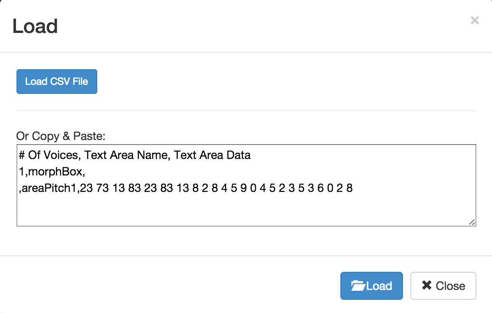

# Soundbash the Past

---

### _on   deformation & performance   of digital data_
<small>Shawn Graham, Carleton U, @electricarchaeo</small>
<small>follow along at   [j.mp/sg-regina](http://j.mp/sg-regina)</small>

---

Deformance vs Deformation 
<small>Sample, [Towards a Deformed Humanities](http://www.samplereality.com/2012/05/02/notes-towards-a-deformed-humanities/)</small>

---

<section data-background="https://farm8.staticflickr.com/7188/6786558606_24bf54c04c_o_d.jpg">
</section>

---
<section data-background="http://i.imgur.com/MBnL4Wm.jpg"</section>

---

Metaphors Matter.

----
<section data-background="https://farm6.staticflickr.com/5492/9920067926_9a9ba5fb45_o_d.jpg"></section>

---

<section data-background="https://farm8.staticflickr.com/7472/15637796200_3f50cfc72e_o_d.jpg">
The Trousers of Time -T. Pratchett
</section>

---

<section data-background="https://farm4.staticflickr.com/3603/3361593196_e5b985a857_o_d.jpg"></section>

---
The Historian's Gaze 

---

...archaeologists have weird metaphors too, when you think about it...

---

Sherlock Holmes was a jerk. 

---

Weirdness of 'seeing the past'

---

<section data-background="http://www.dayofarchaeology.com/wp-content/uploads/2014/07/IMG_20140711_164910.jpg">
...picture this...
</section>

Note:
We've always been augmenting reality. But maybe we could make things a bit more... awesome. image: http://www.dayofarchaeology.com/cakes-cottages-and-manky-bones/

---

(click to play video)

...consider the Museum Diorama...

Note:
Stu Eve app. This video continues to blow me away. No AR app I've seen in the intervening years comes as close.

---

(click to play video)

---

even an essay is an attempt at augmented or virtual reality

---

<section data-background="https://upload.wikimedia.org/wikipedia/commons/2/29/Minard.png">
Note:
hundreds of years of getting to consensus on viz; map w/ north at top, TVP story
</section>

---

<section data-background="playfic.png">
Note:
top-down perspective, god's eye view, one way of messing with this
</section>

---

So we have to make things weird again, disrupt consensus

---

# A Brief Tangent

---

To make things weird, we first have to normalize them

---

And that means disrupting the game of being a student

---

---

---

---

Some focus on place.

---

---

---

Some focus on pushing the physical into the digital and back to the physical world.

---

---

---

Some tell algorithmic stories.

---

---

Some build worlds

---

[RideauCraft](https://docs.google.com/presentation/d/1GYZKKFpatf0fYf71akcSvDu4Qtb1RA9fCPhcdtajaS4/edit?pli=1#slide=id.p)

---

[VimyCraft](https://dl.dropboxusercontent.com/u/37716296/vimyparadata.html)

---

The Medic's War

---

Lack of grammar for the other modalities is an opportunity to figure out new ways of knowing.

---

# /tangent

---

Note:
photobashing ... occupies a liminal position in archae because it puts 'something captured through a mechanical process through a subjective one'
Value in it- because it 'sit[s] at an intersection of subjective processes and mechanical capture, allows for some interesting interactions and reflexivity between both sides of this discussion'. Photobashing is deformation.

---

So. 
...Soundbashing?

Note:
so by analogy to photobashing, take data captured from algorithmic process and punch it through a subjective process and back again.

---

Note:
Different than soundscapes, archaeoacoustics
http://www.nature.com/nature/journal/v506/n7487/full/506158a.html?WT.ec_id=NATURE-20140213

---

Rob Blades:  
"Historians merely hear the past without actually listening"

---

[Historical Friction](http://graeworks.net/historicalfriction)

---

Songs for Jesuits
[Recording](https://soundcloud.com/shawn-graham-60451318/jesuits-groove)

Note:
Try to live-code the performance; play notes.tick plays the data straight up, etc
---

Rest of this workshop: let's make some noise!

<small>[Image Credits](soundbashcredits.md)</small>

---

+ [Tutorial on sonification for historians](http://programminghistorian.github.io/ph-submissions/lessons/sonification)
+ [Tutorials on games, augmented reality, and photogrammetry](https://github.com/shawngraham/ar-archaeology/blob/master/workshop%20materials/readme.md)

---

## From Site to Sound

<small> Topic model viz is [here](http://bl.ocks.org/shawngraham/raw/b7a0ce3eb646158439f0/#topic=20&lambda=1&term=)</small>
---

## Musicalgorithms

[http://musicalgorithms.org/](http://musicalgorithms.org/)

